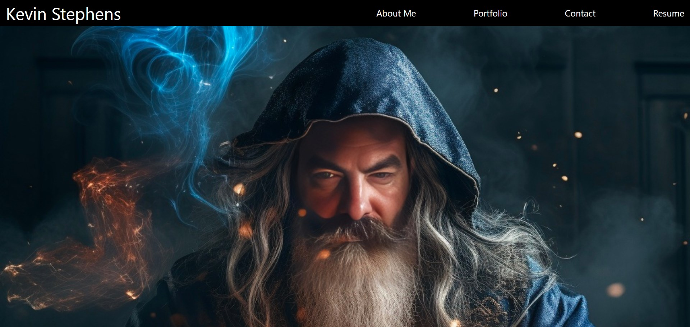

# React Portfolio

## Description

This Portfolio site (work in progress) was created to showcase my previous work to this point and what I've learned along the way. It was composed using all the technologies correlated to the REACT front end library. It was deployed to a live site using Netlify. This was a great opportunity to begin applying certain fundamentals necessary to utilize REACT in building out the front end of an application. 

## Sample View

## License

MIT Licensed

